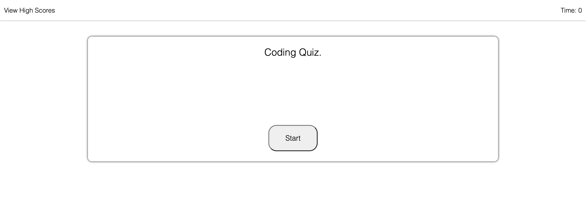

# Coding-Assessment

## Description

A standard coding project to implement a variety of skills across HTML, CSS, and Javascript langauges in order to create a dynamic API.

The biggest challenge I faced with while working on this API was using javascript to dynamically create HTML elements on the page and getting the elements to render properly. The high score list was exceptionally tricky. I ended up using a mix of style selectors and javascript to get the results I wanted.

Another issue I came across was creating a list of scores to store. I not only had to keep track of correct answers but also associate them with a name and properly store the results for later use. Accessing the right data members and insuring the scores showed up on the page how I intended was a new and challenging experience which brought me quite some difficulties but was a highly rewarding once accomplished.

Some things I would like to improve on are the inconsitence use of Javascripts element selectors and the use of CSS to position the highscore screen and submit score screen. I would also like to improve the navigation of the quiz so the user could press a reset button or freely navigate to any page that is made available to the user throughout the duration of the quiz.

## Links

- https://charliefontanez.github.io/coding-assessment/

- https://github.com/charliefontanez/coding-assessment

## Tools Used

- HTML
- CSS
- Javascript
- Visual Studio
- Chrome Dev Tools
- Live Server
- Lots of Googling

